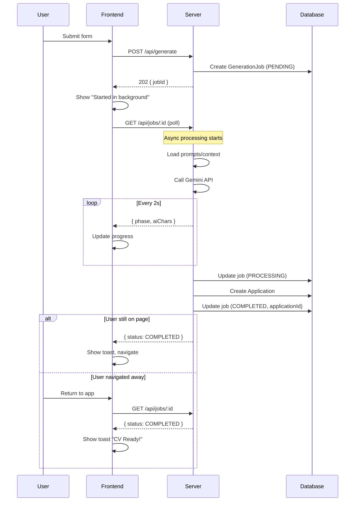

# Background CV Generation - Implementation Plan

## Overview

Enable users to navigate away from the CV generation page while generation continues in the background. When complete, the user receives an in-app toast notification.

## Architecture

```
┌─────────────────┐     POST /api/generate      ┌─────────────────┐
│  NewApplication │ ──────────────────────────▶  │   Express API   │
│      Page       │     Returns jobId+202      │    Server       │
└─────────────────┘                              └────────┬────────┘
        │                                                 │
        │ Poll /api/jobs/:id                              │ Async processing
        │ every 2s while active                          │ (setImmediate)
        │                                                 │
        ▼                                                 ▼
┌─────────────────┐                              ┌─────────────────┐
│   Job Status    │◀────────────────────────────│  GenerationJob  │
│    Polling      │     SSE or poll updates      │     (DB)        │
└─────────────────┘                              └────────┬────────┘
        │                                                 │
        │ Job complete                                    │ On complete:
        ▼                                                 │
┌─────────────────┐                              ┌────────┴────────┐
│  Toast Notif.   │                              │  Create App +   │
│  "CV Ready!"    │                              │  Store result   │
└─────────────────┘                              └─────────────────┘
```

## Database Changes

### New Model: `GenerationJob`

```prisma
model GenerationJob {
  id            String         @id @default(cuid())
  createdAt    DateTime       @default(now())
  updatedAt    DateTime       @updatedAt
  
  // Job state
  status        JobStatus      @default(PENDING)
  error         String?        @db.Text
  
  // Input params (same as Application)
  companyName       String
  jobTitle          String
  jobDescription    String       @db.Text
  targetLanguage    Language     @default(EN)
  additionalContext String?      @db.Text
  parentId          String?
  
  // Result
  applicationId     String?      // Set when complete
  
  // Progress tracking (for polling)
  phase             String?      // "preparing" | "ai-working" | "finalizing"
  aiChars           Int          @default(0)
}

enum JobStatus {
  PENDING
  PROCESSING
  COMPLETED
  FAILED
}
```

## API Changes

### 1. POST /api/generate
**Changes**: Fire-and-forget. Creates job, returns immediately.

**Request**: Same as before
```json
{
  "companyName": "...",
  "jobTitle": "...",
  "jobDescription": "...",
  "targetLanguage": "EN",
  "additionalContext": "..."
}
```

**Response**: `202 Accepted`
```json
{
  "jobId": "cjls2z3000001...",
  "status": "PENDING",
  "message": "Generation started in background"
}
```

### 2. GET /api/jobs/:id
**New endpoint** - Poll for job status.

**Response**:
```json
{
  "id": "cjls2z3000001...",
  "status": "PROCESSING",
  "phase": "ai-working",
  "aiChars": 4500,
  "applicationId": null,
  "error": null
}
```

When complete:
```json
{
  "id": "cjls2z3000001...",
  "status": "COMPLETED",
  "phase": "finalizing",
  "aiChars": 8000,
  "applicationId": "cjls2z3000002...",
  "error": null
}
```

### 3. GET /api/jobs
**New endpoint** - List active jobs (for reconnecting to in-progress jobs on page load).

**Response**:
```json
{
  "jobs": [
    { "id": "...", "status": "PROCESSING", "companyName": "Acme", "jobTitle": "Engineer" }
  ]
}
```

## Frontend Changes

### 1. NewApplication.tsx

**Flow**:
1. Submit form → POST /api/generate → get jobId
2. Show "Generation started in background" with jobId displayed
3. Start polling GET /api/jobs/:id every 2 seconds
4. Update progress bar based on `phase` and `aiChars`
5. On complete → show toast "CV for {company} is ready!" → navigate to dashboard
6. On error → show error toast

**State**:
```typescript
interface GenerationState {
  jobId: string | null;
  status: 'idle' | 'started' | 'polling' | 'complete' | 'error';
  phase: 'preparing' | 'ai-working' | 'finalizing';
  aiChars: number;
  error: string | null;
  applicationId: string | null;
}
```

### 2. DialogContext Enhancements

Add persistent toast functionality:
- `toast(message, severity, duration, persistent)` where `persistent: true` keeps it until dismissed
- This ensures the "CV Ready" notification persists until user clicks it

### 3. App-level Job Tracking (optional enhancement)

- Store active jobId in sessionStorage
- On app mount, check for any in-progress jobs
- Show notification if job completed while user was away

## Implementation Order

1. **Prisma schema update** - Add GenerationJob model
2. **Server: Job service** - Create `server/services/job.ts` for job CRUD
3. **Server: Update generate.ts** - Split into sync (create job) and async (process job)
4. **Server: Add job routes** - GET /api/jobs/:id, GET /api/jobs
5. **Frontend: Job hook** - Create `src/hooks/useJobStatus.ts`
6. **Frontend: Update NewApplication** - Use new polling-based flow
7. **Frontend: Enhance DialogContext** - Add persistent toast option
8. **Update ARCHITECTURE.md**

## Key Files to Modify

| File | Changes |
|------|---------|
| `prisma/schema.prisma` | Add GenerationJob model |
| `server/services/job.ts` | New - job management service |
| `server/generate.ts` | Refactor to async job processing |
| `server/routes.ts` | Add job endpoints |
| `src/hooks/useJobStatus.ts` | New - polling hook |
| `src/pages/NewApplication.tsx` | Use job-based flow |
| `src/context/DialogContext.tsx` | Add persistent toasts |
| `ARCHITECTURE.md` | Document new design |

## Mermaid: Generation Flow



## Backward Compatibility

- Keep `POST /api/applications/:id/regenerate` working (it calls `handleGenerate` internally)
- Regenerate can continue using SSE since it's a modal interaction where user stays on page
