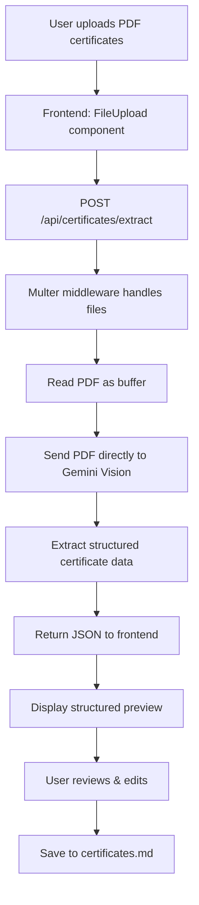

# Certificate PDF Upload & OCR Feature Plan

## Overview
Add functionality to upload PDF certificates, process them using OCR (via Google Gemini's vision capabilities), extract structured information, and display it for review before saving to the certificates context.

## Architecture Flow



## Technical Implementation

### 1. Dependencies to Add
```json
{
  "multer": "^1.4.5-lts.1",
  "uuid": "^9.0.0"
}
```

Dev dependencies:
```json
{
  "@types/multer": "^1.4.7",
  "@types/uuid": "^9.0.0"
}
```

### 2. Database Schema Addition (Prisma)

```prisma
model Certificate {
  id          String   @id @default(cuid())
  createdAt   DateTime @default(now())
  updatedAt   DateTime @updatedAt
   
  // Certificate details
  name        String
  issuer      String
  issueDate   String?  // Flexible date format
  expiryDate  String?  // For certifications that expire
  credentialId String? // Certificate/license number
  skills      String[] // Skills covered
  description String?  @db.Text
   
  // Source tracking
  sourceFile  String?  // Original filename
  verified    Boolean  @default(false)
   
  // Raw extracted text (for debugging/reference)
  rawExtractedText String? @db.Text
}
```

### 3. Backend Components

#### A. Certificate Extraction Service (`server/services/certificate-extractor.ts`)
- Uses Gemini 3.1 Flash Lite Preview (multimodal) model
- Sends PDF content as base64 inlineData directly to Gemini Vision
- Prompts AI to extract structured certificate data
- Returns standardized JSON format

#### B. File Upload Handler (`server/middleware/upload.ts`)
- Multer configuration for PDF files
- File size limits (e.g., 10MB max)
- Temporary storage in `uploads/certificates/`
- File cleanup after processing

#### C. API Routes (`server/routes.ts` additions)

```typescript
// Upload and extract certificates from PDFs
POST /api/certificates/extract
- Accepts: multipart/form-data with 'files' field (multiple PDFs allowed)
- Returns: Array of extracted certificate objects

// CRUD for saved certificates
GET    /api/certificates          // List all certificates
POST   /api/certificates          // Save extracted certificate
PATCH  /api/certificates/:id      // Update certificate
DELETE /api/certificates/:id      // Delete certificate

// Sync to markdown
POST /api/certificates/sync-to-context  // Sync to certificates.md
```

### 4. Frontend Components

#### A. CertificateUpload Component (`src/components/CertificateUpload.tsx`)
- Drag-and-drop zone for PDF files
- File list with status indicators
- "Process" button to trigger OCR
- Progress indicator during processing

#### B. CertificatePreview Component (`src/components/CertificatePreview.tsx`)
- Display extracted certificates in cards
- Editable fields for each certificate:
  - Certificate Name
  - Issuer/Organization
  - Issue Date
  - Expiry Date (if applicable)
  - Credential ID
  - Skills/Topics covered
  - Description
- Add/Remove certificate entries
- Validation indicators

#### C. Settings Page Integration
- Add new section: "Certificate Import"
- Place below existing "Certificates & Extra Context"
- Button to import from PDF → opens upload modal
- Preview extracted certificates before saving
- "Save to Context" button updates certificates.md

### 5. Data Flow

**Extraction Schema:**
```typescript
interface ExtractedCertificate {
  name: string;           // e.g., "AWS Certified Solutions Architect"
  issuer: string;         // e.g., "Amazon Web Services"
  issueDate?: string;     // e.g., "2023-05-15" or "May 2023"
  expiryDate?: string;    // e.g., "2026-05-15" (null if no expiry)
  credentialId?: string;  // e.g., "AWS-123456789"
  skills: string[];       // e.g., ["Cloud Architecture", "AWS Lambda"]
  description?: string;   // Brief description of what was learned
  confidence: number;     // AI confidence score (0-1)
}
```

### 6. AI Prompt Strategy

The extraction prompt will use Gemini's structured output capability:

```
You are a certificate data extraction specialist. Analyze the provided PDF certificate and extract the following information in JSON format:

REQUIRED FIELDS:
- name: The full certificate/credential name
- issuer: The organization that issued the certificate

OPTIONAL FIELDS (extract if present):
- issueDate: When the certificate was issued (ISO format if possible)
- expiryDate: When the certificate expires (null if not found)
- credentialId: License/certificate number
- skills: Array of skills, technologies, or topics covered
- description: Brief summary of what the certification validates

RULES:
1. Never invent information - if a field is not present in the certificate, set it to null
2. For dates, preserve the format found or convert to YYYY-MM-DD
3. Skills should be concise (1-3 words each)
4. Return ONLY valid JSON, no markdown formatting
5. Include a "confidence" field (0.0-1.0) indicating your certainty

CERTIFICATE CONTENT:
[PDF base64 data sent directly to Gemini Vision]
```

### 7. Error Handling

- **File too large**: Return 413 with clear message
- **Invalid file type**: Only accept PDF, reject others
- **OCR failed**: Return partial results with error flag
- **AI extraction incomplete**: Flag low-confidence fields for manual review

### 8. UI/UX Considerations

- Show thumbnail preview of uploaded PDF
- Highlight low-confidence extractions in yellow
- Allow manual correction of any field
- Batch process multiple certificates efficiently
- Show progress bar for multiple file uploads
- Confirmation dialog before overwriting existing certificates

## Implementation Order

1. **Phase 1**: Backend foundation
   - Add dependencies
   - Create upload middleware
   - Implement extraction service with Gemini Vision
   - Add API routes

2. **Phase 2**: Database & Storage
   - Add Certificate model to Prisma
   - Run migration
   - Implement certificate CRUD operations

3. **Phase 3**: Frontend components
   - Create CertificateUpload component
   - Create CertificatePreview component
   - Add API integration

4. **Phase 4**: Integration
   - Update Settings page with new certificate import section
   - Implement sync to certificates.md
   - Add error handling and validation

5. **Phase 5**: Testing & Polish
   - Test with various certificate PDFs
   - Handle edge cases
   - UI refinements
