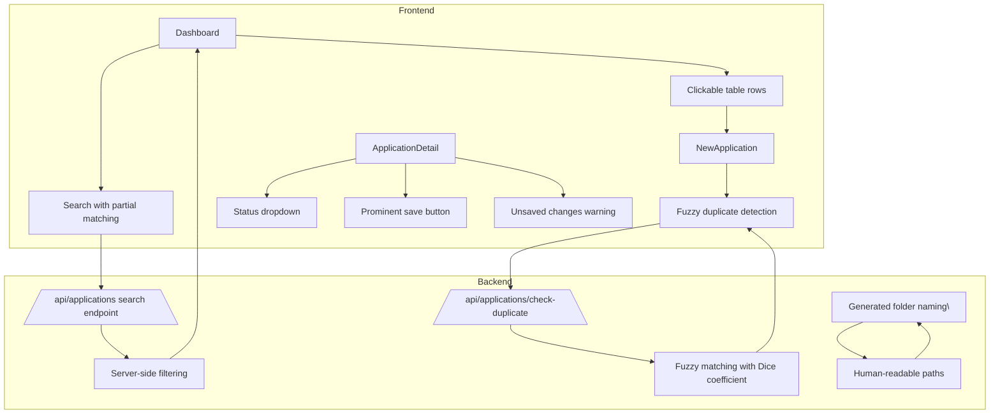

# CVForge 8 Enhancements Implementation Plan

## Context
This plan addresses 8 enhancement requests for CVForge, a CV generation application built with React/TypeScript frontend and Express/Prisma backend.

---

## Feature 1: Clickable Table Rows in Applications Dashboard

**Current Behavior:** Only the company name in each table row is a clickable link.

**Desired Behavior:** The entire table row should be clickable to navigate to application details.

**Files to Modify:**
- `src/pages/Dashboard.tsx` (lines 279-310)

**Implementation:**
1. Wrap the `<tr>` element with a Link component or add an onClick handler with useNavigate
2. Ensure action buttons (download, delete) remain functional and don't trigger navigation
3. Add cursor pointer styling to indicate clickability

**Approach:**
```tsx
<tr 
  onClick={() => navigate(`/applications/${app.id}`)}
  className="cursor-pointer border-b border-border hover:bg-bg-elevated transition-colors group..."
>
  {/* Exclude action buttons from click handler - they'll use stopPropagation */}
</tr>
```

---

## Feature 2: Auto-Disappearing Toasts

**Current Behavior:** Some toasts (e.g., "CV for X is ready!") use `duration: 0, persistent: true` which means they never auto-dismiss.

**Desired Behavior:** All toasts should auto-disappear after a suitable timeout (~4-5 seconds).

**Files to Modify:**
- `src/context/DialogContext.tsx` (line 59) - toast function
- `src/pages/NewApplication.tsx` (line 63) - handleJobComplete
- `src/pages/NewApplication.tsx` (line 73) - handleJobError
- `src/hooks/useJobStatus.ts` - any persistent toast calls

**Implementation:**
1. Remove all `persistent: true` flags from toast calls
2. Change `duration: 0` to `duration: 4000` (4 seconds) for consistent behavior
3. Consider adding a helper function `toastSuccess()` and `toastError()` with sensible defaults

**Assumption:** All toasts will auto-disappear after 4 seconds, including success/error notifications. The user can manually dismiss before timeout if desired.

---

## Feature 3: Status Dropdown Instead of Buttons

**Current Behavior:** Status selection uses button segments in a grid (lines 283-294 in ApplicationDetail.tsx).

**Desired Behavior:** Status should be a styled dropdown/select menu.

**Files to Modify:**
- `src/pages/ApplicationDetail.tsx` (lines 283-294)

**Implementation:**
1. Replace the button grid with a styled `<select>` element
2. Apply consistent styling matching the app's design system
3. Maintain same status options: GENERATED, APPLIED, INTERVIEW, OFFER, REJECTED, WITHDRAWN

**Approach:**
```tsx
<select 
  value={status} 
  onChange={e => setStatus(e.target.value)}
  className="w-full bg-bg-base border border-border px-4 py-2 text-text-primary focus:outline-none focus:border-accent"
>
  {STATUSES.map(s => (
    <option key={s} value={s}>{s}</option>
  ))}
</select>
```

---

## Feature 4: Prominent Save Button Placement

**Current Behavior:** "Save Changes" button is inside the status/notes box (lines 307-313 in ApplicationDetail.tsx).

**Desired Behavior:** Save button should be outside the box, similar to Settings page (which has it in the header area at lines 199-206).

**Files to Modify:**
- `src/pages/ApplicationDetail.tsx`

**Implementation:**
1. Move the Save Changes button from inside the status section to the header area or sidebar header
2. Make it more prominent with accent color styling
3. Similar to Settings page pattern: `className="flex items-center gap-2 bg-accent hover:bg-accent-hover text-text-on-accent font-medium px-6 py-2.5 transition-colors"`

---

## Feature 5: Unsaved Changes Warning on Navigation

**Current Behavior:** No warning when navigating away from Application Detail page with unsaved changes.

**Desired Behavior:** Warn user when attempting to navigate away with unsaved changes.

**Files to Modify:**
- `src/pages/ApplicationDetail.tsx`

**Implementation:**
1. Track dirty state for notes and status changes (currently only tracks latexSource)
2. Use React Router's `useBlocker` or `usePrompt` from `react-router-dom`
3. Show a confirmation dialog when user tries to navigate with unsaved changes

**Approach:**
```tsx
const isDirty = notes !== originalNotes || status !== originalStatus || latexSource !== savedLatexSource;

// Use useBlocker when dirty
useBlocker(({ nextLocation }) => {
  if (isDirty && !nextLocation.pathname.startsWith('/applications/')) {
    return true; // Block navigation
  }
  return false;
}, [isDirty]);
```

---

## Feature 6: Fix Search Filter with Partial Word Matching

**Current Behavior:** Search only filters the current page's applications client-side (line 118-121 in Dashboard.tsx).

**Desired Behavior:** 
1. Search should query all applications (server-side)
2. Support partial word/substring matching

**Files to Modify:**
- `src/pages/Dashboard.tsx` (lines 118-128, 37-53)
- `server/routes.ts` (applications GET endpoint)

**Implementation:**
1. Add search query parameter to the API endpoint: `GET /api/applications?skip=0&take=100&search=term`
2. Update server to filter by companyName and jobTitle using case-insensitive contains (SQL LIKE %term%)
3. Update Dashboard to pass search term to API instead of filtering client-side
4. Remove client-side filtering, use server-filtered results

**API Changes:**
```typescript
// server/routes.ts
apiRouter.get('/applications', async (req, res) => {
  const { skip, take, search } = req.query;
  const where: any = { deletedAt: null };
  
  if (search) {
    where.OR = [
      { companyName: { contains: search, mode: 'insensitive' } },
      { jobTitle: { contains: search, mode: 'insensitive' } },
    ];
  }
  
  const [applications, total] = await prisma.application.findMany({ where, ... });
});
```

---

## Feature 7: Fuzzy Duplicate Job Detection

**Current Behavior:** No duplicate detection when applying to similar jobs.

**Desired Behavior:** Warn user if applying to a job that appears to be a duplicate (fuzzy matching on job description).

**Files to Modify:**
- `src/pages/NewApplication.tsx`
- `server/routes.ts` (new endpoint for duplicate check)
- Potentially add `string-similarity` library or implement Levenshtein distance

**Implementation:**
1. Install `string-similarity` library for fuzzy text matching
2. Add a new API endpoint: `POST /api/applications/check-duplicate`
3. Send job description to server, compare with existing applications using Dice coefficient or similar
4. If similarity > threshold (e.g., 0.7), return warning with matched application(s)
5. Show warning in UI before allowing generation

**API Design:**
```typescript
// Request
POST /api/applications/check-duplicate
{ jobDescription: string }

// Response
{ 
  hasDuplicate: boolean,
  matches: Array<{ id, companyName, jobTitle, similarity: number }>
}
```

**Fuzzy Matching Algorithm:**
- Use Dice coefficient (string-similarity library)
- Normalize text: lowercase, trim whitespace, remove common job description boilerplate
- Compare against all existing job descriptions
- Threshold: 0.7 (70% similarity = potential duplicate)

---

## Feature 8: Human-Readable Generated Folder Names

**Current Behavior:** Generated files stored in `generated/{application-id}/`.

**Desired Behavior:** Append company name and job title to folder name: `generated/{id}-{companyName}-{jobTitle}/`

**Files to Modify:**
- `server/routes.ts` (multiple endpoints referencing genDir)
- Potentially `server/generate.ts` for initial folder creation

**Implementation:**
1. Create a helper function `getGenDir(app: Application)` that builds the path
2. Sanitize companyName and jobTitle for filesystem safety (remove special chars, limit length)
3. Update all references to `generated/{id}` to use the new path format
4. Handle migration: existing folders with old format should still work

**Helper Function:**
```typescript
function getGenDir(app: { id: string; companyName: string; jobTitle: string }): string {
  const sanitize = (s: string) => s.replace(/[^a-zA-Z0-9]/g, '_').slice(0, 50);
  const company = sanitize(app.companyName);
  const title = sanitize(app.jobTitle);
  return path.join('generated', `${app.id}-${company}-${title}`);
}
```

**Filesystem Locations to Update:**
- `server/routes.ts`: PATCH `/applications/:id` (line ~199)
- `server/routes.ts`: DELETE `/applications/:id` (line ~217)
- `server/routes.ts`: GET `/applications/:id/download/pdf` (line ~225)
- Any other location referencing the generated directory

---

## Summary Diagram



---

## Execution Order

1. **Feature 6** (Search filter) - Backend API change, lowest risk
2. **Feature 1** (Clickable rows) - Simple UI change
3. **Feature 3** (Status dropdown) - Simple UI change
4. **Feature 4** (Save button) - Simple UI change
5. **Feature 2** (Toast timing) - Small changes across files
6. **Feature 5** (Unsaved warning) - React Router integration
7. **Feature 7** (Duplicate detection) - New API + fuzzy matching library
8. **Feature 8** (Folder naming) - Backend filesystem changes

---

## Notes

- **Feature 2 Assumption:** All toasts auto-disappear after 4 seconds, including success/error. If completion toasts should remain until dismissed, adjust accordingly.
- **Feature 8 Migration:** Old folder paths (`generated/{id}`) should continue to work via redirects or fallback logic.
- **Feature 7 Dependencies:** Requires adding `string-similarity` npm package.
