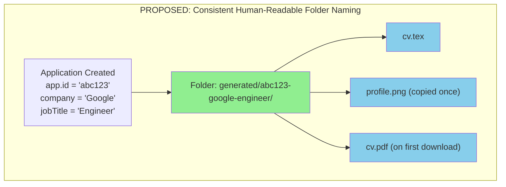

# CV Generation Folder Structure Refactor Plan

## Problem Analysis

### Root Cause of Duplicate Folders

Two different folder naming strategies exist:

| Location | Folder Pattern | Purpose |
|----------|---------------|---------|
| `generate.ts:142` | `generated/<timestamp>/` | Stores CV during AI generation |
| `routes.ts:23-33` `getGenDir()` | `generated/<appId>-<company>-<jobTitle>/` | Used for PDF download & deletion |

**Issue**: When downloading a PDF, `routes.ts` looks for LaTeX in `generated/<appId>-<company>-<jobTitle>/` but the file was actually written to `generated/<timestamp>/`. Since it's not found, a new folder is created at the "human-readable" path, resulting in **two folders per CV**.

### Profile Image Duplication

The profile image ends up in multiple places:
1. `uploads/profile/<original>` - original upload location
2. `generated/<timestamp>/profile.png` - copied during generation
3. `generated/<appId>-<company>-<jobTitle>/profile.png` - copied again during PDF download (if timestamp folder wasn't found)

---

## Solution Architecture



**Key Change**: Use the existing `getGenDir(app)` pattern from `routes.ts` in `generate.ts` as well. The folder naming is `<appId>-<company>-<jobTitle>` - already human-readable. The problem was that `generate.ts` was using `Date.now()` instead of this function.

---

## Implementation Steps

### Step 1: Extract shared `getGenDir` utility

Create `server/utils/gen-dir.ts`:
```typescript
import path from 'path';

/**
 * Returns the canonical generated folder path for an application.
 * Uses application ID only for simplicity and consistency.
 */
export function getGenDir(appId: string): string {
  return path.join(process.cwd(), 'generated', appId);
}
```

### Step 2: Update `generate.ts`

**Before** (line 142):
```typescript
const genDir = path.join(process.cwd(), 'generated', Date.now().toString());
```

**After**:
```typescript
const genDir = getGenDir(app.id);
```

**Flow change**:
1. Create application record FIRST (to get the ID)
2. Then create folder using app ID
3. Then generate CV

### Step 3: Update `profile-image.ts`

Add an `alreadyExists` check to avoid redundant copies:

```typescript
export async function prepareProfileImage(
  latexContent: string,
  genDir: string,
): Promise<string> {
  const userProfileImage = await findProfileImage();
  const imageRegex = /\\includegraphics(?:\[[^\]]*\])?\{([^}]+)\}/g;
  const hasImageRef = /\\includegraphics(?:\[[^\]]*\])?\{([^}]+)\}/.test(latexContent);

  if (userProfileImage) {
    const ext = path.extname(userProfileImage);
    const destFilename = `profile${ext}`;
    const destPath = path.join(genDir, destFilename);
    
    // Only copy if not already present
    try {
      await fs.access(destPath);
    } catch {
      await fs.copyFile(userProfileImage, destPath);
    }

    return latexContent.replace(
      imageRegex,
      `\\includegraphics[width=95pt]{${destFilename}}`
    );
  }
  // ... rest unchanged
}
```

### Step 4: Update `routes.ts`

- Import shared `getGenDir` from utils
- Remove local `getGenDir` function
- Update DELETE endpoint to use `app.id` directly

### Step 5: Update Backup/Restore

**`backup.ts` changes**:
- Add `genDir` field to `BackupApplication` interface
- Query and include the generated folder path per application

**`restore.ts` changes**:
- After restoring application, recreate the folder structure
- Copy the LaTeX content to the correct folder path

---

## Files to Modify

| File | Change |
|------|--------|
| `server/utils/gen-dir.ts` | **NEW** - shared utility |
| `server/generate.ts` | Use shared `getGenDir`, create app before folder |
| `server/services/profile-image.ts` | Skip copy if file exists |
| `server/routes.ts` | Import shared `getGenDir`, remove local version |
| `server/services/backup.ts` | Include `genDir` in backup data |
| `server/services/restore.ts` | Recreate folder structure on restore |

---

## Data Migration Considerations

For existing data:
- Old timestamp-based folders will become orphaned
- They can be cleaned up manually or via a migration script
- The database still has `latexOutput` which is the source of truth

---

## Testing Checklist

- [ ] Generate new CV → single folder created with app ID
- [ ] Profile image copied only once
- [ ] Download PDF → uses same folder, doesn't create duplicate
- [ ] Delete application → folder cleaned up correctly
- [ ] Backup includes correct folder paths
- [ ] Restore recreates folder structure correctly
