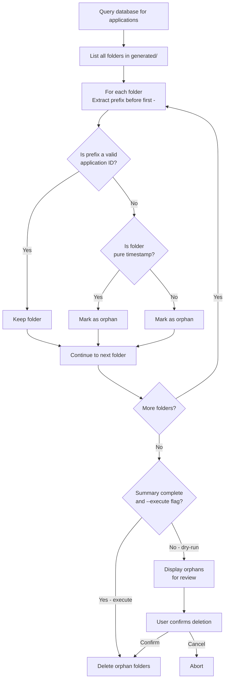

# Orphan Folder Cleanup Plan

## Context

The `generated/` folder currently contains ~90+ folders, but only 21 applications exist in the database. Many folders are orphaned from:
1. Old timestamp-based naming (`1773877244063`)
2. Legacy partial CUID folders without suffixes (`cmmtvjqbd0000wondxo9ge1tt`)
3. Failed/completed generation jobs whose database records were deleted

## Folder Naming Pattern

From [`getGenDir()`](server/utils/gen-dir.ts):
```
generated/<appId>-<sanitizedCompany>-<sanitizedJobTitle>/
```

Where `sanitize()` converts to lowercase and replaces non-alphanumeric chars with hyphens.

Examples from current folders:
- `cmn33kx150002woykay2lfc4s-attio-product-engineer` → ID: `cmn33kx150002woykay2lfc4s`, Company: `attio`, Job: `product-engineer`
- `1773877244063` → timestamp-based (orphan)
- `cmmtvjqbd0000wondxo9ge1tt` → partial CUID (orphan - no suffix means it doesn't match pattern)

## Identification Strategy

A folder is **valid** if it matches the pattern: `{validAppIdPrefix}-{...}`

We check validity by:
1. Query all application IDs from database
2. For each folder in `generated/`:
   - Extract the prefix (before first `-`)
   - If prefix matches a known application ID → **KEEP**
   - If folder is a pure timestamp (digits only) → **ORPHAN**
   - If prefix doesn't match any app ID → **ORPHAN**

## Implementation

### Script: `server/utils/cleanup-orphans.ts`

```typescript
import { PrismaClient } from '@prisma/client';
import { getGenDir } from './gen-dir.js';
import fs from 'fs/promises';
import path from 'path';

const prisma = new PrismaClient();

interface CleanupResult {
  totalFolders: number;
  validFolders: number;
  orphanFolders: string[];
  errors: string[];
}

export async function cleanupOrphans(dryRun: boolean = true): Promise<CleanupResult> {
  const result: CleanupResult = {
    totalFolders: 0,
    validFolders: 0,
    orphanFolders: [],
    errors: [],
  };

  // 1. Get all application IDs
  const apps = await prisma.application.findMany({
    where: { deletedAt: null },
    select: { id: true, companyName: true, jobTitle: true },
  });

  const validAppIds = new Set(apps.map(a => a.id));
  
  // 2. Compute expected folder names for validation
  const validFolderNames = new Set(
    apps.map(app => path.basename(getGenDir(app)))
  );

  // 3. List all folders in generated/
  const generatedDir = path.join(process.cwd(), 'generated');
  const entries = await fs.readdir(generatedDir, { withFileTypes: true });
  const folders = entries.filter(e => e.isDirectory()).map(e => e.name);

  result.totalFolders = folders.length;
  console.log(`[${dryRun ? 'DRY-RUN' : 'CLEANUP'}] Found ${folders.length} folders, ${apps.length} applications\n`);

  // 4. Classify each folder
  for (const folder of folders) {
    if (validFolderNames.has(folder)) {
      result.validFolders++;
      console.log(`  ✓ KEEP: ${folder}`);
    } else if (/^\d+$/.test(folder)) {
      // Pure timestamp folder
      result.orphanFolders.push(folder);
      console.log(`  ✗ ORPHAN [timestamp]: ${folder}`);
    } else {
      // Extract prefix (before first `-`) and check if it's a valid app ID
      const prefix = folder.split('-')[0];
      
      // Check if prefix is a valid CUID (24 chars, alphanumeric)
      if (prefix.length >= 20 && validAppIds.some(id => id.startsWith(prefix))) {
        // Partial match - might be a valid folder with truncated suffix
        result.validFolders++;
        console.log(`  ✓ KEEP (partial match): ${folder}`);
      } else {
        result.orphanFolders.push(folder);
        console.log(`  ✗ ORPHAN [no match]: ${folder}`);
      }
    }
  }

  // 5. Delete orphans if not dry-run
  if (!dryRun && result.orphanFolders.length > 0) {
    console.log(`\nDeleting ${result.orphanFolders.length} orphan folders...`);
    for (const folder of result.orphanFolders) {
      const folderPath = path.join(generatedDir, folder);
      try {
        await fs.rm(folderPath, { recursive: true });
        console.log(`  ✓ Deleted: ${folder}`);
      } catch (err: any) {
        result.errors.push(`Failed to delete ${folder}: ${err.message}`);
        console.error(`  ✗ Failed: ${folder} - ${err.message}`);
      }
    }
  }

  // Summary
  console.log(`\n${dryRun ? 'DRY-RUN ' : ''}Summary:`);
  console.log(`  Total folders: ${result.totalFolders}`);
  console.log(`  Valid (to keep): ${result.validFolders}`);
  console.log(`  Orphan (to delete): ${result.orphanFolders.length}`);
  if (result.errors.length > 0) {
    console.log(`  Errors: ${result.errors.length}`);
  }

  return result;
}

// Run as standalone script
if (import.meta.url === `file://${process.argv[1]}`) {
  const dryRun = !process.argv.includes('--execute');
  
  console.log(`Orphan folder cleanup ${dryRun ? '(dry-run mode - no changes will be made)' : '(EXECUTE mode)'}\n`);
  
  cleanupOrphans(dryRun)
    .then(result => {
      if (result.orphanFolders.length === 0) {
        console.log('\n✅ No orphan folders found');
      } else if (dryRun) {
        console.log('\n💡 Run with --execute to delete orphan folders');
      } else {
        console.log('\n✅ Cleanup completed');
      }
      process.exit(result.errors.length > 0 ? 1 : 0);
    })
    .catch(err => {
      console.error('Fatal error:', err);
      process.exit(1);
    });
}
```

## Execution Flow



## Usage

```fish
# Dry-run (preview what would be deleted)
npx tsx server/utils/cleanup-orphans.ts

# Execute (actually delete orphans)
npx tsx server/utils/cleanup-orphans.ts --execute
```

## Safety Measures

1. **Dry-run by default** - Must explicitly pass `--execute` to delete
2. **Application ID prefix matching** - Handles both full folder names and partial CUID matches
3. **Timestamp detection** - Pure numeric folder names are always orphans
4. **Error handling** - Continues on individual deletion errors
5. **Summary output** - Clear listing of what was kept vs deleted

## Expected Outcome

| Metric | Before | After |
|--------|--------|-------|
| Folders in `generated/` | ~90+ | ~21 |
| Orphan folders | ~70+ | 0 |
