# Profile Image Support Implementation Plan

## Problem Statement

The app currently cannot handle profile images in the LaTeX CV file. When users want to export their CV as PDF, the LaTeX compilation may fail if:
1. The source CV references an image file that doesn't exist
2. The user wants to use their own uploaded profile picture instead of the one in the master CV

## Requirements

1. **Settings Page**: User can upload their profile picture in a dedicated section
2. **CV Generation**: If source CV has a profile picture, use the user-uploaded picture instead
3. **Fallback**: If no user image provided but CV has an image reference, add a dummy/placeholder image so LaTeX compiles

## Current Analysis

### Master CV Structure
The master CV (`context/master-cv.tex`) references profile image:
```latex
\begin{minipage}[t]{0.22\textwidth}
    \vspace{0pt}
    \includegraphics[width=95pt]{profile_2.png}
\end{minipage}
```

This uses `\includegraphics{profile_2.png}` which requires the image file to exist when compiling.

---

## Implementation Steps

### Step 1: Backend API - Profile Image Management
**File: `server/routes.ts`**

Add three new endpoints:
- `POST /api/settings/profile-image` - Upload profile image (accept jpg, png, webp, max 5MB)
- `GET /api/settings/profile-image` - Get profile image metadata (exists, filename, url)
- `DELETE /api/settings/profile-image` - Delete profile image

Storage location: `uploads/profile/` directory (single global image)

### Step 2: Frontend - Settings Page Enhancement
**File: `src/pages/Settings.tsx`**

Add new section after "Master CV Section" with:
- Profile picture upload area (drag & drop or click to browse)
- Preview thumbnail of current profile picture
- Delete button to remove existing image
- Allowed formats indicator (JPG, PNG, WebP)

### Step 3: LaTeX Generation - Image Handling
**File: `server/generate.ts`**

Modify the `handleGenerate` function:

1. After generating LaTeX, check if user has uploaded a profile image in `uploads/profile/`
2. **If user uploaded image exists**:
   - Copy the uploaded image to the generated application directory (`generated/{appId}/`)
   - Update the LaTeX `\includegraphics{}` command to reference the correct filename
   - Replace pattern like `\includegraphics{profile_2.png}` with the actual uploaded filename
3. **If no uploaded image but LaTeX references an image**:
   - Create a simple 1x1 transparent PNG placeholder in the generated directory
   - Keep the original image reference (LaTeX will compile with placeholder)

### Step 4: PDF Compilation - Image Handling
**File: `server/routes.ts`**

Modify the `/applications/:id/download/pdf` endpoint:
- Already handled by Step 3 - the image is copied to the generated directory before PDF compilation
- No additional changes needed

---

## Workflow Diagram

```mermaid
flowchart TD
    A[User uploads profile picture] --> B[Settings Page sends to API]
    B --> C[API stores in uploads/profile/]
    D[User generates CV] --> E[LaTeX Generation]
    E --> F{User has profile image?}
    F -->|Yes| G[Copy image to generated dir]
    F -->|No| H{LaTeX has image ref?}
    G --> I[Update LaTeX to use user image]
    H -->|Yes| J[Create placeholder image]
    H -->|No| K[No changes needed]
    J --> K
    I --> L[Compile PDF]
    J --> L
    K --> L
```



---

## File Changes Summary

| File | Changes |
|------|---------|
| `server/routes.ts` | Add profile image upload/get/delete API endpoints |
| `src/pages/Settings.tsx` | Add profile picture upload UI section |
| `server/generate.ts` | Add image handling logic during LaTeX generation |

---

## Acceptance Criteria

1. ✅ User can upload a profile picture in Settings (jpg, png, webp)
2. ✅ User can view their currently uploaded profile picture
3. ✅ User can delete their uploaded profile picture
4. ✅ Generated CV uses user-uploaded image instead of master CV image
5. ✅ If no user image but LaTeX references one, a placeholder is created so PDF compiles
6. ✅ PDF export works successfully with profile images
